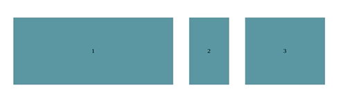

# Flexbox

<div id="indice"></div>

* [flex-direction](#flex-direction)
* [justify-content](#justify-content)
* [flex-basis](#flex-basis)
* [flex-grow & flex-shrink](#flex-grow--flex-shrink)
* [flex](#flex)
* [flex-wrap](#flex-wrap)
* [order](#order)
* [align-content vs align-items](#align-content-vs-align-items)
* [align-self](#align-self)


<br><hr>
<hr><br>


## flex-direction

<sub>[Volver al índice](#indice) | [justify-content >>](#justify-content)</sub>

Esta propiedad permite seleccionar el eje principal de un ***flex container***.

Para crear un ***flex container***, utilizamos la propiedad `display: flex;` en un elemento. Esto nos permite utilizar las propiedades de ***flexbox*** en ese elemento.

<br>

Las opciones posibles para esta propiedad son las siguientes:

* `flex-direction: row;` (default)
* `flex-direction: row-reverse;`
* `flex-direction: column;`
* `flex-direction: column-reverse;`

<br>

Si tenemos un ***flex container*** dentro de otro ***flex container***, uno debe tener dirección `row` y el otro `column`.

Si utilizamos `display: flex;` en un elemento, por defecto, su dirección es `row`.


<br><hr>
<hr><br>


## justify-content

<sub>[<< flex-direction](#flex-direction) | [Volver al índice](#indice) | [flex-basis >>](#flex-basis)</sub>

La propiedad `justify-content` nos permite alinear los elementos de un ***flex container*** en el eje principal.

Por recordar, el eje principal se define utilizando la propiedad `flex-direction`. Si la dirección es `row`, el eje principal es horizontal y si es `column`, el eje principal es vertical.

<br>

Las posibilidades al utilizar esta propiedad son las siguientes:

* `justify-content: flex-start;` (default) → los elementos se alinean al inicio del ***flex container***.
* `justify-content: flex-end;` → los elementos se alinean al final del ***flex container***.
* `justify-content: center;` → los elementos se alinean al centro del ***flex container***.
* `justify-content: space-between;` → los elementos se distribuyen en el ***flex container***, dejando un espacio entre ellos.
* `justify-content: space-around;` → los elementos se distribuyen en el ***flex container***, dejando un espacio entre ellos y alrededor de los elementos.
* `justify-content: space-evenly;` → los elementos se distribuyen en el ***flex container***, dejando espacios iguales entre ellos y alrededor de los elementos.


<br><hr>
<hr><br>


## flex-basis

<sub>[<< justify-content](#justify-content) | [Volver al índice](#indice) | [flex-grow & flex-shrink >>](#flex-grow--flex-shrink)</sub>

Esta propiedad permite definir el tamaño inicial de un elemento. A medida que el tamaño del ***flex container*** cambia, el tamaño de los elementos también cambia, pero en proporción al tamaño inicial que se les asignó.

Se utilizan los mismos valores que para las propiedades `width` y `height`.

<br>

Por ejemplo, si tenemos el siguiente código HTML:

```html
<div class="container">
    <div class="blocks">
        <div class="block block1">1</div>
        <div class="block block2">2</div>
        <div class="block block3">3</div>
    </div>
</div>
```

<br>

Y el siguiente código CSS:

```css
body {
    margin: 0;
    padding: 0;
}

.container {
    margin: 0;
    height: calc(100vh - 20px);
    width: calc(100vw - 20px);
    border: 10px solid red;
    display: flex;
    justify-content: center;
    align-items: center;
}

.blocks {
    display: flex;
    justify-content: center;
    align-items: center;
    width: 1000px;
}

.block {
    background-color: cadetblue;
    height: 200px;
    margin: 20px;
    display: flex;
    justify-content: center;
    align-items: center;
}
```

<br>

Tendremos todos los elementos del mismo tamaño y alineados en el centro. Si quisiéramos modificar sus tamaños y que la proporción se mantuviera, podríamos utilizar la propiedad `flex-basis`:

```css
.block1 {
    flex-basis: 400px;
}

.block2 {
    flex-basis: 100px;
}

.block3 {
    flex-basis: 200px;
}
```

<br>

Este sería el resultado:



<br>

Si ahora disminuyéramos el tamaño del ***flex container***, los elementos se reducirían en proporción al tamaño inicial que se les asignó:


<br><hr>
<hr><br>


## flex-grow & flex-shrink

<sub>[<< flex-basis](#flex-basis) | [Volver al índice](#indice) | [flex >>](#flex)</sub>

Ambas propiedades nos permiten modificar el tamaño de los elementos de un ***flex container***.

Son opuestas entre sí, ya que `flex-grow` aumenta el tamaño de los elementos y `flex-shrink` los reduce. Por defecto, todos los elementos tienen el mismo tamaño, pero si se quiere agrandar o reducir alguno en concreto, se pueden utilizar estas propiedades.

<br>

* ***flex-grow →*** indica la velocidad con la que el elemento indicado crece.

Manteniendo el ejemplo HTML anterior y el CSS de base también, modificamos los siguientes valores:

```css
.block1 {
    flex-grow: 4;
}

.block2 {
    flex-grow: 1;
}

.block3 {
    flex-grow: 2;
}
```

<br>

El resultado en este caso se vería aproximadamente como en el caso anterior utilizando [flex-basis](#flex-basis), e incluso parece el mismo. Sin embargo, si agrandamos a pantalla completa, el `flex-grow` hará que los elementos crezcan en la proporción indicada, `flex-basis` hará lo mismo, pero manteniendo el tamaño máximo indicado.

<br>

* ***flex-shrink →*** indica la velocidad con la que el elemento indicado se reduce.

Manteniendo el ejemplo HTML anterior y el CSS de base también, modificamos los siguientes valores:

```css
.block1 {
    flex-basis: 400px;
    flex-grow: 2;
}

.block2 {
    flex-basis: 100px;
    flex-grow: 1;
}

.block3 {
    flex-basis: 200px;
    flex-grow: 1;
}
```

<br>

Al utilizar `flex-shrink` se debe indicar el tamaño de `flex-basis` para que funcione correctamente.

Esta vez, los elementos en pantalla completa se verían de la misma forma que en el apartado de [flex-basis](#flex-basis), pero si reducimos el tamaño de la ventana, los elementos se reducirán en proporción al valor de `flex-shrink` que se les haya asignado.

Este sería el resultado:


<br><hr>
<hr><br>


# flex

<sub>[<< flex-grow & flex-shrink](#flex-grow--flex-shrink) | [Volver al índice](#indice) | [flex-wrap >>](#flex-wrap)</sub>

Esta propiedad nos permite definir el tamaño inicial de un elemento, así como la velocidad con la que crece o se reduce. Es decir, es un ***shortcut*** de `flex-grow`, `flex-shrink` y `flex-basis`.

<br>

Esta propiedad puede tener una cantidad variable de valores:

* **Un valor:**
    * `flex-grow`
    * `flex-basis`
    * `none`
* **Dos valores:**
    * El primer valor será `flex-grow` siempre
    * El segundo valor puede ser `flex-basis` o `flex-shrink`
* **Tres valores:**
    * El primer valor será `flex-grow`
    * El segundo valor será `flex-shrink`
    * El tercer valor será `flex-basis`

<br>

Además de estas opciones, también se pueden utilizar palabras reservadas como:

* `initial`: el ítem tomará el tamaño acorde a `width` y `height`, podrá disminuir a su tamaño mínimo, pero no crecer para absorber el espacio disponible. Es el equivalente a `flex: 0 1 auto`.
* `auto`: el ítem tomará el tamaño acorde a `width` y `height`, pero crece hasta absorber todo el espacio disponible.


<br><hr>
<hr><br>


## flex-wrap

<sub>[<< flex](#flex) | [Volver al índice](#indice) | [order >>](#order)</sub>

En ocasiones se tiene un contenedor con varios elementos contenidos en su interior. Se desea alinear todo al centro utilizando Flexbox, pero si el tamaño de la ventana es muy pequeño, los elementos se desplazan a la derecha y no respetan el tamaño del contenedor.

Para solucionar este problema, se puede utilizar la propiedad `flex-wrap`.

<br>

Imaginemos que tenemos el siguiente código HTML:

```html
<div class="container">
    <div class="img-blocks">
        
        
        
        
        
        
        
        
    </div>
</div>
```

<br>

Y el siguiente CSS:

```css
body {
    margin: 0;
    padding: 0;
}

.container {
    margin: 0;
    height: calc(100vh - 20px);
    width: calc(100vw - 20px);
    border: 10px solid red;

    display: flex;
    justify-content: center;
    align-items: center;
}

.container > .img-blocks {
    display: flex;
    justify-content: center;
    align-items: center;
}

.img-blocks img {
    margin: 5px;
    height: 120px;
    width: auto;
}
```

<br>

El resultado sería el siguiente:


<br>

Desde luego, ese no era el resultado que se pretendía conseguir. Para hacer que las imágenes se alineen correctamente y *salten* a la siguiente línea cuando no quepan en la ventana, se debe utilizar la propiedad `flex-wrap`:

```css
.container > .img-blocks {
    display: flex;
    justify-content: center;
    align-items: center;
    flex-wrap: wrap;
}
```

<br>

Ahora sí, el resultado sería el siguiente al tener la ventana pequeña:


<br>

Y el resultado sería el siguiente al tener la ventana grande:


<br><hr>
<hr><br>


## order

<sub>[<< flex-wrap](#flex-wrap) | [Volver al índice](#indice) | [align-content vs align-items >>](#align-content-vs-align-items)</sub>

Esta propiedad nos permite ordenar los elementos de un contenedor. Por defecto, los elementos se ordenan de izquierda a derecha y de arriba a abajo, teniendo en cuenta el orden en el que han sido descritos en el archivo HTML.

Sin embargo, con esta propiedad se puede cambiar el orden de los elementos.

<br>

Imaginemos que tenemos el siguiente código HTML:

```html
<div class="container">
    <div class="blocks">
        <div class="block block1">1</div>
        <div class="block block2">2</div>
        <div class="block block3">3</div>
    </div>
</div>
```

<br>

Con el siguiente CSS:

```css
body {
    margin: 0;
    padding: 0;
}

.container {
    margin: 0;
    height: calc(100vh - 20px);
    width: calc(100vw - 20px);
    border: 10px solid red;
    display: flex;
    justify-content: center;
    align-items: center;
}

.blocks {
    display: flex;
    justify-content: center;
    align-items: center;
    width: 1000px;
}

.block {
    background-color: cadetblue;
    height: 200px;
    margin: 20px;
    display: flex;
    justify-content: center;
    align-items: center;
}

.block1 {
    flex-basis: 400px;
    flex-shrink: 2;
}

.block2 {
    flex-basis: 100px;
}

.block3 {
    flex-basis: 400px;
}
```

<br>

El resultado sería el siguiente:


<br>

Si usamos la propiedad `order` en los elementos, podemos cambiar el orden de los mismos:

```css
.block1 {
    flex-basis: 400px;
    flex-shrink: 2;
}

.block2 {
    flex-basis: 100px;
    order: 1;
}

.block3 {
    flex-basis: 400px;
    order: 2;
}
```

<br>

El resultado sería el siguiente:


<br><hr>
<hr><br>


## align-content vs align-items

<sub>[<< order](#order) | [Volver al índice](#indice) | [align-self >>](#align-self)</sub>

Tanto `align-content` como `align-items` son propiedades que nos permiten alinear los elementos de un contenedor.

La diferencia entre ambas es que `align-items` alinea los elementos dejando espacio tanto entre los elementos, como entre ellos y el borde del contenedor, mientras que `align-content` alinea los elementos dejando espacio entre los elementos y el borde del contenedor, pero no entre ellos.

<br>

Este es un ejemplo de `align-items`:


<br>

Y este es un ejemplo de `align-content`:


<br><hr>
<hr><br>


## align-self

<sub>[<< align-content vs align-items](#align-content-vs-align-items) | [Volver al índice](#indice)</sub>

Esta propiedad nos permite alinear un elemento en concreto dentro de un contenedor.

Como valores posibles toma los mismos que se pueden utilizar con align-items y align-content, pero esta vez, afecta únicamente a un elemento.