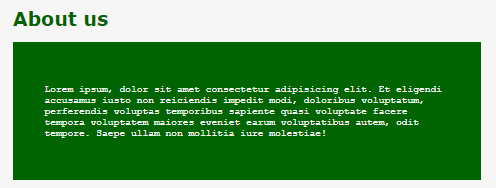

# Introducción a SCSS

* [¿Qué es SCSS?](#¿qué-es-scss)
* [Diferencia entre SASS y SCSS](#diferencia-entre-sass-y-scss)
* [Variables en SCSS](#variables-en-scss)
* [Mixins](#mixins)
* [Valores por defecto](#default-values)


<br><hr>
<hr><br>


## ¿Qué es SCSS?

SCSS son las siglas de Sassy Cascading Style Sheets. Fue creado hace aproximadamente 10 años por Hampton Catlin.

¿Dónde se puede usar SCSS? A día de hoy, puede usarse en prácticamente cualquier tipo de framework. No está atado a ningún tipo concreto de elemento.

¿Por qué usar SCSS? SCSS permite agilizar todo el proceso de implementación de un diseño. Escribir únicamente con CSS puro está bien, pero lo que SCSS permite, es agilizar el proceso de implementación de un diseño, ya que permite escribir código CSS de una forma más sencilla y rápida, eliminando cualquier tipo de proceso repetitivo.

Técnicamente, SCSS es un preprocesador, lo que significa que es un tipo de lenguaje que el navegador no entiende. Cuando el preprocesador se ejecuta, lo que hace es convertir todo el código SCSS que escribiste en código CSS, de forma que el navegador sí que lo entienda, construyendo tus propios archivos CSS para ti.


<br><hr>
<hr><br>


## Diferencia entre SASS y SCSS

**SASS** es la versión original de SCSS. No se parece en nada al CSS y se preocupa por cosas como la indentación. No tiene llaves, tiene signos de más y signos de igual por todas partes, etc.

**SCSS** se parece exactamente al CSS, usa llaves y puntos y comas. Es mucho más familiar.

Si quieres escribir código CSS puro, un archivo SCSS lo procesará, mientras que la versión original de SASS lanzaría un error.


<br><hr>
<hr><br>


## Variables en SCSS

Las variables son una especie de contenedor donde se puede almacenar el valor de una propiedad. En este caso, vamos a crear dos variables de colores para aplicarlas a lo largo el programa:

``` scss
$off-white: #f6f6f6;
$master-site-color: darkred;

body {
    background-color: $off-white;
    height: 100vh;
    width: 100vw;
}

.container {
    font-family: Verdana, Geneva, Tahoma, sans-serif;
    font-size: 0.8rem;
}

.page-wrapper {
    padding: 21px;

    .featured {
        color: $master-site-color;
    }

    .page-content{
        background-color: $master-site-color;
        padding: 42px;
        color: $off-white;

        .container {
            font-family: 'Courier New', Courier, monospace;
        }
    }
}
```

<br>

Este sería el resultado:


<br>

Como se puede ver, las variables son muy útiles para no tener que repetir el mismo valor en diferentes partes del código. Además, si se quiere cambiar el valor de una variable, se puede hacer de forma muy sencilla, sin tener que cambiar el valor en cada parte del código donde se haya usado.

Por ejemplo, si modificamos la variable `$master-site-color` a un color verde, el programa se vería así:




<br><hr>
<hr><br>


## Mixins

Son una especie de funciones que pueden ser "llamadas". Son muy útiles para aplicar los mismos estilos en diferentes elementos, o simplemente para ayudar a organizar los estilos. Para definir un *"mixin"*, se usa la sintaxis `@mixin`.

En este ejemplo, vamos a crear los siguientes:

``` scss
@mixin heading-feature-styling {
    color: $master-site-color;
}

@mixin section-feature-styling {
    background-color: $master-site-color;
    padding: 42px;
    color: $off-white;
}
```

<br>

Esto haría que el programa se viera modificado, ***¿por qué? ¿Qué es lo que falta?***

Ahora, nos queda indicar qué elementos deben *"coger"* las propiedades definidas en dichos mixins. Para ello, se usa la palabra reservada `@include`:

``` scss
.page-wrapper {
    padding: 21px;

    .featured {
        @include heading-feature-styling;
    }

    .page-content{
        @include section-feature-styling;

        .container {
            font-family: 'Courier New', Courier, monospace;
        }
    }
}
```

<br>

Como se puede observar, el resultado no se vería modificado:


<br><hr>
<hr><br>


## Valores por defecto

Podemos crear valores por defecto de la siguiente manera:

``` scss
@mixin heading-feature-styling {
    $feature-color: DarkRed !default;
    color: $feature-color;
}

@mixin section-feature-styling {
    $feature-color: DarkRed !default;
    background-color: $feature-color;
    padding: 42px;
    color: $off-white;
}
```

<br>

Así es como se vería:


<br>

Si la variable `$feature-color` no se define (como si fuera una variable más), se usará el valor especificado antes de `!default`. Pero si se crea una variable con ese nombre, se usará ese valor de la variable:

``` scss
/* VARIABLES */
$feature-color: darkgreen;

/* MIXINS */
@mixin heading-feature-styling {
    $feature-color: DarkRed !default;
    color: $feature-color;
}

@mixin section-feature-styling {
    $feature-color: DarkRed !default;
    background-color: $feature-color;
    padding: 42px;
    color: $off-white;
}
```

<br>

En este caso, así es como quedaría:


<br><hr>
<hr><br>


## Anidación en SCSS

Para anidar elementos en CSS se podía utilizar `<` para indicar que un elemento se encontraba dentro de otro.

Con SCSS se vuelve todo mucho más sencillo. Ya se ha visto en los ejemplos anteriores la sintáxis para anidar elementos, o indicar que uno se encuentra dentro del otro. Para ello, basta con escribir y dar estilo al elemento dentro de su contenedor:

``` scss
.page-wrapper {
    padding: 21px;

    .featured {
        @include heading-feature-styling;
    }

    .page-content{
        @include section-feature-styling;

        .container {
            font-family: 'Courier New', Courier, monospace;
        }
    }
}
```

<br>

En este ejemplo, podemos entender que el elemento `.container` se encuentra dentro del elemento `.page-content`, que a su vez se encuentra dentro del elemento `.page-wrapper`.

`.page-content` está dentro de `.page-wrapper`, pero `.featured` también, lo que significa que estos dos elementos se encuentran dentro de un mismo contenedor: `.page-wrapper`.