# Flask

<div id="indice"></div>

* [Instalar Flask](#instalar-flask)
    * [Arrancar la aplicación](#arrancar-la-aplicación)
* [Dependencias de Flask](#dependencias-de-flask)
* [Crear una base de datos SQLite con SQLAlchemy](#crear-una-base-de-datos-sqlite-con-sqlalchemy)
* **Peticiones HTTP:**
    * [POST Request](#crear-un-post-api-endpoint)
    * [GET all Request](#crear-un-get-request)
    * [GET single Request](#crear-un-single-get-request)
    * [PUT Request](#actualizar-datos-con-un-put-request)
    * [DELETE Request](#eliminar-datos-con-un-delete-request)


<br><hr>
<hr><br>


## Instalar Flask

<sub>[Volver al índice](#indice) | [Arrancar la app >>](#arrancar-la-aplicación)</sub>

Los requisitos para trabajar con Flask en este curso son:

* Tener pipvenv instalado
* Tener un elemento como Postman para poder comprobar las peticiones

<br>

A continucaión, vamos a ver cómo crear un proyecto con Flask. Para ello, abriremos la terminal y ejecutaremos los siguientes comandos:

```bash
# crear un directorio para el proyecto
# hay que poner todo el url del directorio, no como aquí
mkdir hello-flask

# entrar en el directorio
cd hello-flask

# crear el entorno virtual
pipenv --python 3   # versión 3 de python

# instalar flask
pipenv install flask
```

<br>

En el directorio del proyecto veremos que tenemos los archivos `Pipfile` y `Pipfile.lock`. En el primero de ellos, veremos que ahora indica que en el apartado `[packages]` tenemos instalado `flask = "*"`.

<br>

Creamos el archivo `app.py` y escribimos las siguientes líneas de código:

```python
from flask import Flask

# crea nueva instancia de flask y la guarda dentro de variable 'app'
app = Flask(__name__)

# creamos una 'route'
@app.route('/')
def hello():
    return "Hey Flask"


if __name__ == "__main__":
    app.run(debug=True)
```


<br><hr><br>


### Arrancar la aplicación

<sub>[<< Instalar Flask](#instalar-flask) | [Volver al índice](#indice) | [Dependencias de Flask >>](#dependencias-de-flask)</sub>

Ahora, volveremos a la terminal y ejecutaremos los siguientes comandos:

```bash
pipenv shell    # activa el entorno virtual

python app.py   # ejecuta el archivo app.py
```

<br>

Al ejecutarlo, nos saldrán los siguientes mensajes:

```bash
* Serving Flask app 'app'
* Debug mode: on
WARNING: This is a development server. Do not use it in a production deployment. Use a production WSGI server instead.
* Running on http://127.0.0.1.5000      # url de la app -> podría ser distinta en otro caso
* Restarting with stat
* Debugger is active!
* Debugger PIN: 123-456-789             # pin para poder debuggear
```

<br>

Nos indica que está ejecutándose en la url indicada, que es lo mismo que decir que está en `localhost:5000`. Si abrimos el navegador y ponemos `localhost:5000`, veremos que nos sale el mensaje `Hey Flask`.

Si miramos en la terminal, veremos que aún se está ejecutando el servidor. Si queremos pararlo, tendremos que pulsar `Ctrl + C`.

Si lo paramos y volvemos a la página de `localhost:5000` y refrescamos, veremos que ya no funciona.


<br><hr>
<hr><br>


## Dependencias de Flask

<sub>[<< Arrancar la app](#arrancar-la-aplicación) | [Volver al índice](#indice) | [Crear base de datos SQLite >>](#crear-una-base-de-datos-sqlite-con-sqlalchemy)</sub>

En este apartado, vamos a ver cómo instalar dependencias que prodrían ser necesarias para nuestro proyecto.

<br>

La primera que vamos a instalar es `flask-sqlalchemy`. Lo que hace es permitirnos comunicarnos con una base de datos sin necesitar escribir código SQL como tal. Para ello, ejecutaremos los siguientes comandos:

```bash
# desde el directorio del proyecto (hello-flask)
pipenv install Flask-SQLAlchemy
```

<br>

La siguiente que vamos a instalar es `flask-marshmallow`. Lo que nos permite es renderizar los datos JSON de una forma muchísimo más sencilla. Para ello, ejecutaremos los siguientes comandos:

```bash
# desde el directorio del proyecto (hello-flask)
pipenv install flask-marshmallow
```

<br>

La última que vamos a instalar es una que combina las dos anteriores: `marshmallow-sqlalchemy`. Lo que nos permite es combinar las dos dependencias anteriores. Para ello, ejecutaremos los siguientes comandos:

```bash
# desde el directorio del proyecto (hello-flask)
pipenv install marshmallow-sqlalchemy
```

<br>

Si miramos en el archivo `Pipfile`, veremos que ahora tenemos las tres dependencias instaladas:

```pipfile
[packages]
flask = "*"
flask-sqlalchemy = "*"
flask-marshmallow = "*"
marshmallow-sqlalchemy = "*"
```

<br>

Ahora vamos a comprobar que los elementos instalados funcionan. Para ello, entraremos en el archivo ya creado, `app.py`, e importaremos las dependencias, el archivo quedaría así:

```python
from flask import Flask
from flask_sqlalchemy import SQLAlchemy
from flask_marshmallow import Marshmallow
import os

# crea instancia de flask y la guarda dentro de variable
app = Flask(__name__)

# creamos una 'route'
@app.route('/')
def hello():
    return "Hey Flask"


if __name__ == "__main__":
    app.run(debug=True)
```

<br>

Volvemos a la terminal y ejecutamos el archivo `app.py`:

```bash
python app.py
```

<br>

Veremos que nos salen los mismos mensajes que antes y no hay errores, por lo que se han importado correctamente todas las dependencias.


<br><hr>
<hr><br>


## Crear una base de datos SQLite con SQLAlchemy

<sub>[<< Dependencias de Flask](#dependencias-de-flask) | [Volver al índice](#indice) | [Crear una POST API >>](#crear-un-post-api-endpoint)</sub>

Vamos a crear una base de datos SQLite, por lo que no vamos a usar código SQL puro, sino que vamos a usar SQLAlchemy. Vamos a crear el esquema (tabla) con la que vamos a trabajar, y vamos a permitir al código generar esa tabla por nosotros.

<br>

En primer lugar, vamos a acceder al archivo `app.py` y vamos a eliminar las siguientes líneas de código:

```python
@app.route('/')
def hello():
    return "Hey Flask"
```

<br>

A continución, vamos a integrarlo con nuestro sistema de base de datos. Habíamos llamado anteriormente a la librería `os`, ahora vamos a utilizarla para crear un directorio para la base de datos. Este directorio es necesario porque sin él, flask no podrá saber dónde guardar la tabla SQLite.

El código, tras realizar todas las modificaciones, queda de la siguiente manera:

```python
from flask import Flask
from flask_sqlalchemy import SQLAlchemy
from flask_marshmallow import Marshmallow
import os

app = Flask(__name__)

# le decimos a flask dónde está la base de datos
basedir = os.path.abspath(os.path.dirname(__file__))

# le pasamos el directorio al que queremos que vaya
# y le decimos que se llama 'app.sqlite'
app.config["SQLALCHEMY_DATABASE_URI"] = "sqlite:///" + os.path.join(basedir, "app.sqlite")

# creamos un objeto de base de datos
db = SQLAlchemy(app)        # instanciar objeto de SQLAlchemy
ma = Marshmallow(app)       # instanciar objeto de Marshmallow

# creamos el esquema de la tabla (heredera de db.Model)
class Guide(db.Model):
    # añadimos una columna de tipo integer, decirmos que es una primary key
    # primary_key=True -> hará que cada Guide tenga su propio ID, y cada ID incrementa automáticamente
    id = db.Column(db.Integer, primary_key=True)
    # creamos 2 columnas más de tipo string 
    # limitamos su cantidad de chars a 100 y 144
    title = db.Column(db.String(100), unique=False)
    content = db.Column(db.String(144), unique=False)

    def __init__(self, title, content):
        self.title = title
        self.content = content


class GuideSchema(ma.Schema):
    class Meta:
        # indicamos los campos a los que queremos acceder dentro de una tupla
        fields = ("title", "content")


guide_schema = GuideSchema()            # para trabajar con 'single guide'
guides_schema = GuideSchema(many=True)  # para trabajar con 'multiple guides'


if __name__ == "__main__":
    app.run(debug=True)
```

<br>

Por último, desde la terminal, vamos a ejecutar el archivo `app.py`:

```bash
# si el entorno virtual ya está activado, saltar este paso:
pipenv shell


python
>>> from app import app, db
# podría dar un warning, pero no pasa nada

>>> app.app_context().push()
>>> db.create_all()
```

<br>

Los pasos que he seguido yo desde la terminal y los de la clase no son los mismos, esto se debe a las actualizaciones de Flask.

<br>

Si nos fijamos en el directorio de trabajo, ahora aparecerá un archivo llamado `app.sqlite`. Este es el archivo de la base de datos que hemos creado.


<br><hr>
<hr><br>


## Crear un POST API Endpoint

<sub>[<< Crear base de datos SQLite](#crear-una-base-de-datos-sqlite-con-sqlalchemy) | [Volver al índice](#indice) | [GET all Request >>](#crear-un-get-request)</sub>

Una vez llegados a este punto, vamos a comenzar a construir la API. Para ello, vamos a comenzar a añadir `guides` a la aplicación.

Como se trata de una API, vamos a utilizar el método `POST` para añadir `guides` a la base de datos. Pero antes de llegar a eso, vamos a añadir las siguientes líneas de código al archivo `app.py`:

```python
# modificamos la importación de Flask
from flask import Flask, request, jsonify

# endpoint to create a new guide
@app.route("/guide", methods=["POST"])  # creamos un guide con el verbo POST
def add_guide():
    # obtener datos de json y guardarlos en sus variables
    title = request.json['title']
    content = request.json['content']

    new_guide = Guide(title, content)   # nueva isntancia de Guide

    # comunicarse con la data base
    db.session.add(new_guide)           # añadir el guide al db
    db.session.commit()

    # asegurarnos de que funciona el código
    guide = Guide.query.get(new_guide.id)
    
    return guide_schema.jsonify(guide)
```

<br>

El código al completo, tras realizar todas las modificaciones, queda de la siguiente manera:

```python
from flask import Flask, request, jsonify
from flask_sqlalchemy import SQLAlchemy
from flask_marshmallow import Marshmallow
import os

app = Flask(__name__)

basedir = os.path.abspath(os.path.dirname(__file__))
app.config["SQLALCHEMY_DATABASE_URI"] = "sqlite:///" + os.path.join(basedir, "app.sqlite")
# creamos un objeto de base de datos
db = SQLAlchemy(app)        # instanciar objeto de SQLAlchemy
ma = Marshmallow(app)       # instanciar objeto de Marshmallow

# creamos el esquema de la tabla (heredera de db.Model)
class Guide(db.Model):
    id = db.Column(db.Integer, primary_key=True)
    title = db.Column(db.String(100), unique=False)
    content = db.Column(db.String(144), unique=False)

    def __init__(self, title, content):
        self.title = title
        self.content = content


class GuideSchema(ma.Schema):
    class Meta:
        fields = ("title", "content")


guide_schema = GuideSchema()            # para trabajar con 'single guide'
guides_schema = GuideSchema(many=True)  # para trabajar con 'multiple guides'

# endpoint to create a new guide
@app.route("/guide", methods=["POST"])  # creamos un guide con el verbo POST
def add_guide():
    # obtener datos de json y guardarlos en variables
    title = request.json['title']
    content = request.json['content']

    new_guide = Guide(title, content)   # nueva isntancia de Guide

    # comunicarse con la data base -> añadir el guide al db
    db.session.add(new_guide)
    db.session.commit()

    # asegurarnos de que funciona el código
    guide = Guide.query.get(new_guide.id)
    return guide_schema.jsonify(guide)


if __name__ == "__main__":
    app.run(debug=True)
```

<br>

Ahora, vamos a probar el código. Para ello, desde la terminal, vamos a hacer lo siguiente:

```bash
# si no está activado el entorno virtual, activarlo, si ya está activado, saltar este paso:
pipenv shell

python app.py
```

<br>

Ya está en marcha el servidor. Ahora, vamos a comprobar que funciona haciendo una petición `POST` desde **Postman** o cualquier otra aplicación que permita realizar las mismas acciones. En mi caso usaré **Thunder Client** desde Visual Studio Code.

<br>

Los pasos a seguir serán los siguientes:

1. Abrir la extensión **Thunder Client** desde VSCode y clicar en `New Request`.

2. Seleccionar la opción `POST` y escribir la siguiente URL: `localhost:5000/guide`.

    La URL se obtiene de la respuesta al arrancarel archivo app.py desde la terminal, como ya vimos en [apartados anteriores](#arrancar-la-aplicación). El `/guide` es el endpoint que hemos creado en el archivo `app.py`, dentro de la sección de `@app.route()`.

3. En la sección `Tests` vamos a añadir la opción de que compruebe que aquello que obtengamos sea de tipo JSON.

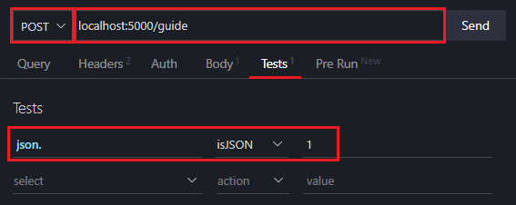

<br>

4. En la sección `Body` vamos a añadir el contenido que queremos que se añada a la base de datos. En este caso, vamos a añadir un `title` y un `content`.

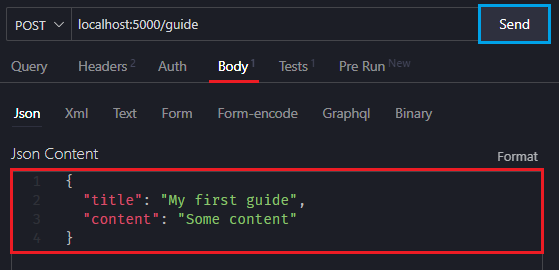

<br>

5. Clicar en la opción `Send` y comprobar que se ha añadido correctamente.

<br>

Si los pasos se han seguido correctamente, deberíamos obtener una respuesta como la siguiente:


<br>

Además, comprobando el resultado del test que habíamos añadido en la sección `Tests`, deberíamos obtener lo siguiente:


<br><hr>
<hr><br>


## Crear un GET Request

<sub>[<< POST](#crear-un-post-api-endpoint) | [Volver al índice](#indice) | [Single GET Request >>](#crear-un-single-get-request)</sub>

Hemos creado un endpoint de `POST` para añadir `guides` a la base de datos. Ahora, vamos a crear un endpoint de `GET` para obtener los `guides` de la misma.

Para ello, añadiremos las siguientes líneas de código al archivo `app.py`, justo debajo de donde habíamos añadido el endpoint de `POST`:

```python
# endpoint to query all guides
@app.route("/guides", methods=["GET"])
def get_guides():
    all_guides = Guide.query.all()              # devuelve todos los Guide del sistema (app)
    result = guides_schema.dump(all_guides)     # trabajaremos con el schema de múltiples

    return jsonify(result)
```

<br>

A continuación, comprobaremos que funciona. Para ello, volveré a hacer uso de **Thunder Client** desde VSCode (puede utilizarse cualquier otra herramienta).

En primer lugar, activaremos el entorno virtual y arrancaremos el servidor (si no lo estuvieran ya):

```bash
pipenv shell

python app.py
```

<br>

Una vez arrancado el servidor, vamos a hacer una petición `GET` desde **Thunder Client**. Para ello, vamos a seguir los siguientes pasos:

1. Abrir la extensión **Thunder Client** desde VSCode y clicar en `New Request`.

2. Seleccionar la opción `GET` y escribir la siguiente URL: `localhost:5000/guides`.


Como ya habíamos hecho una petición `POST` anteriormente, ya deberíamos tener un `guide` en la base de datos. Por lo tanto, si hacemos una petición `GET` deberíamos obtener como resultado el `guide` que habíamos añadido anteriormente.

<br>

Vamos a añadir un nuevo `guide` a la base de datos, para comprobar que funciona todo correctamente. Para ello, vamos a repetir los pasos que ya habíamos seguido para añadir un `guide` a la base de datos, pero en este caso, vamos a añadir un nuevo `guide` con un `title` y un `content` diferentes.

Tener en cuenta que se debe cambiar el tipo de petición a `POST`, y que la url cambia de `localhost:5000/guides` a `localhost:5000/guide` para este tipo de peticiones.

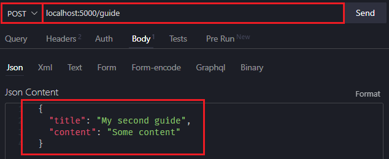

<br>

Ahora, vamos a comprobar que se ha añadido correctamente. Para ello, vamos a volver a realizar una petición `GET`, cambuando la url de `localhost:5000/guide` a `localhost:5000/guides`.

Obtendremos el siguiente resultado:

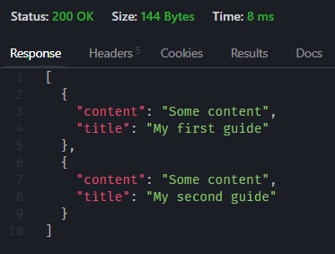

<br>

Como se puede observar, hemos obtenido los dos `guides` que habíamos añadido a la base de datos. **¡Perfecto!**


<br><hr>
<hr><br>


## Crear un Single GET Request

<sub>[<< GET all](#crear-un-get-request) | [Volver al índice](#indice) | [PUT >>](#actualizar-datos-con-un-put-request)</sub>

Hemos creado un endpoint de `GET` para obtener todos los `guides` de la base de datos. Ahora, vamos a crear un endpoint de `GET` para obtener un único `guide` de la base de datos.

A este tipo de petición también se le llama *show route* o *show endpoint*.

<br>

De nuevo, tendremos que modificar el archivo `app.py`. Vamos a añadir las siguientes líneas de código debajo del apartado anterior de `GET`:

```python
# endpoint for querying single guide
@app.route("/guide/<id>", methods=["GET"])
def get_guide(id):          # la función necesita que le pasemos el ID del 'guide'
    # pedimos que obtenga el elemento con el ID que se le haya pasado
    guide = Guide.query.get(id)

    return guide_schema.jsonify(guide)
```

<br>

Como se puede observar, la función `get_guide()` necesita que le pasemos el `id` del `guide` que queremos obtener. En los casos anteriores no era necesario pasar ningún parámetro, ya que o bien se añadía un nuevo `guide` a la base de datos, o bien se obtenían todos los `guides` de la misma.

Sin embargo, ahora queremos tratar u obtener un `guide` en concreto, por lo que necesitamos que la función `get_guide()` sepa qué `guide` queremos obtener.

<br>

Sabiendo esto, volvemos a arrancar la aplicación teniendo activado el entorno virtual:

```bash
pipenv shell

python app.py
```

<br>

Y volvemos a entrar en la aplicación correspondiente para realizar la petición `GET`.

Como ya hemos visto antes, para hacer una petición `GET` hay que indicar que se trata de una petición `GET`, y como la url debe seguir el patrón `localhost:5000/guide/<id>`, escribiremos dicha url modificando `<id>` por el número **id** del elemento que queramos obtener.

Nuestra base de datos solo tiene 2 elementos, por lo que podemos obtener el elemento con el `id` 1 o el elemento con el `id` 2:

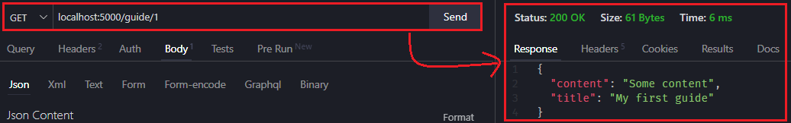

<br>

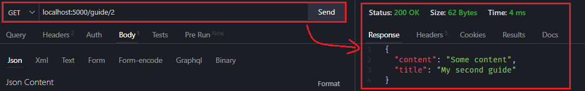

<br>

Es de destacar que, si intentamos obtener un elemento que no existe, no obtendremos un error, sino que obtendremos un objeto vacío:

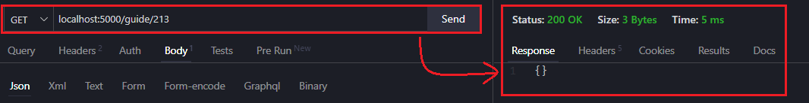


<br><hr>
<hr><br>


## Actualizar datos con un PUT Request

<sub>[<< Single GET Request](#crear-un-single-get-request) | [Volver al índice](#indice) | [DELETE >>](#eliminar-datos-con-un-delete-request)</sub>

En ocasiones se deseará modificar los datos de un elemento de la base de datos. Para ello, se puede utilizar el método `PUT`.

<br>

Para ello, vamos a modificar el archivo `app.py` y añadiremos las siguientes líneas de código debajo del apartado anterior de `GET`:

```python
# endpoint for updating a guide
@app.route("/guide/<id>", methods=["PUT"])
def guide_update(id):
    guide = Guide.query.get(id)         # indicamos qué elemento queremos modificar

    # obtenemos los datos escritos para modificar el elemento
    title = request.json['title']
    content = request.json['content']

    # modificamos el elemento
    guide.title = title
    guide.content = content

    # guardamos los cambios
    db.session.commit()

    return guide_schema.jsonify(guide)
```

<br>

Para esta función, vuelve a necesitarse conocer el `id` del elemento que queremos modificar.

<br>

Ahora, para comprobar que funciona, realizaremos la petición `PUT` desde **Thunder Client** siguiendo los siguientes pasos:

1. Abrir la extensión **Thunder Client** desde VSCode y clicar en `New Request`.

2. Seleccionar la opción `PUT` y escribir la siguiente URL: `localhost:5000/guide/1`, para modificar el primer elemento, por ejemplo.

3. En el apartado de `Body`, escribiremos los cambios que deseemos realizar. Tendremos que escribir tanto el `title` como el `content` del elemento que queremos modificar, si no escribiéramos alguno de los dos, se quedaría como string vacío debido a que en la función hemos especificado que se modifiquen ambos valores.

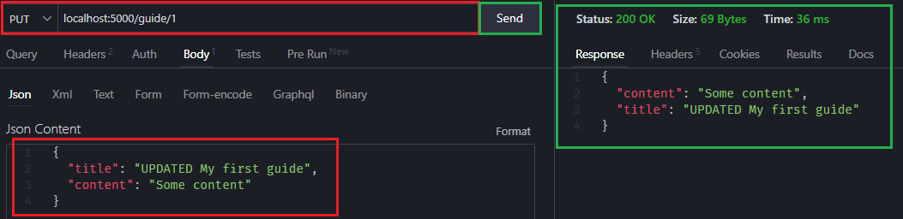

<br>

> Como se observa en la imagen, hemos modificado únicamente el `title`, pero hemos reescrito el `content` para dejarlo como estaba anteriormente.

Tras clicar en `Send`, obtendremos el resultado mostrado en el recuadro de color verde.

<br>

Ahora, vamos a comprobar que se ha modificado correctamente. Para ello, vamos a realizar una petición `GET` para [obtener todos los elementos](#crear-un-get-request) que tenemos en la base de datos:

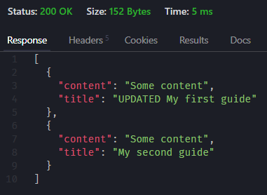

<br>

Como se puede observar, el elemento con el `id` 1 ha sido modificado correctamente.


<br><hr>
<hr><br>


## Eliminar datos con un DELETE Request

<sub>[<< PUT](#actualizar-datos-con-un-put-request) | [Volver al índice](#indice)</sub>

En esta sección vamos a ver cómo eliminar un elemento de la base de datos.

Para poder hacer esto, vamos a añadir las siguientes líneas de código debajo del apartado anterior de `PUT`:

```python
# endpoint for deleting a record
@app.route("/guide/<id>", methods=["DELETE"])
def guide_delete(id):
    guide = Guide.query.get(id)
    db.session.delete(guide)
    db.session.commit()

    return guide_schema.jsonify(guide)
```

<br>

Para realizar la petición `DELETE`, vamos a seguir los siguientes pasos:

1. Abrir la extensión **Thunder Client** desde VSCode y clicar en `New Request`.

2. Seleccionar la opción `DELETE` y escribir la siguiente URL: `localhost:5000/guide/2`, para eliminar el segundo elemento, por ejemplo.

3. Clicar en `Send`.

<br>

Al haber añadido un `return` en la función `guide_delete()`, obtendremos el elemento que hemos eliminado:

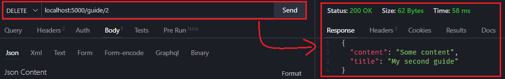

<br>

Si quisiéramos que en lugar de recibir de vuelta el elemento eliminado obtuviéramos un mensaje, podríamos modificar el `return` de la función `guide_delete()` de la siguiente manera:

```python
return "Guide was successfully deleted!"
```

<br>

Si [añadimos 2 elementos más](#crear-un-post-api-endpoint) a la base de datos haciendo uso de la petición `POST` y eliminamos el elemento con el `id` 3, obtendremos el siguiente resultado:

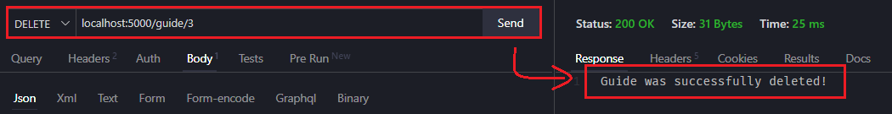