# MongoDB

<div id="indice"></div>

* [Instalar MongoDB](#instalar-mongodb)
* [Introducción a MongoDB](#introducción-a-mongodb)
* **Crear**
    * [Crear un usuario](#crear-un-usuario)
    * [Crear una colección](#crear-una-colección)
* **Añadir**
    * [Añadir documentos a una colección](#añadir-documentos-a-una-colección)
    * [Añadir varios documentos a una colección](#añadir-varios-documentos-a-una-colección)
* **Consultar o buscar**
    * [Consultar todos los documentos de una colección](#consultar-documentos)
    * [Consultar documentos específicos](#consultar-documentos-específicos)
    * [Introducción a las proyecciones](#introducción-a-las-proyecciones)
    * [Selección de arrays anidados usando `$slice`](#selección-de-arrays-anidados-usando-slice)
    * [Colecciones anidadas](#colecciones-anidadas)
    * [Buscar un único documento](#buscar-un-único-documento)
    * [Seleccionar documentos con parte de strings - Regex](#seleccionar-documentos-con-parte-de-strings---regex)
    * [Comprobar si un campo existe o no](#comprobar-si-un-campo-existe-o-no)
* [Eliminar documentos](#eliminar-documentos)


<br><hr>
<hr><br>


## Instalar MongoDB

<sub>[Volver al índice](#indice) | [Introducción >>](#introducción-a-mongodb)</sub>

Se puede acceder a la página de descargas de MongoDB desde [este link](https://www.mongodb.com/docs/manual/tutorial/install-mongodb-on-windows/). En ella aparecen los pasos a seguir para instalar MongoDB en Linux, macOS y Windows.

<br>

Además de instalar MongoDB, también se debe instalar la terminal de MongoDB, `mongosh`. Para ello, se deben seguir las instrucciones de [este enlace](https://www.mongodb.com/docs/mongodb-shell/install/).

* En Windows, si la forma de instalar la terminal es a través de un archivo `.zip`, hay que añadir la ruta de instalación de `mongosh` a la variable de entorno `PATH` para poder ejecutarlo desde cualquier directorio.

> Para ello, accedemos a `panel de control > sistema y seguridad > sistema > configuración avanzada del sistema > variables de entorno > variables de entorno` y añadimos la ruta de la carpeta `bin` de `mongosh` a la variable `PATH`.


<br><hr>
<hr><br>


## Introducción a MongoDB

<sub>[<< Instalación](#instalar-mongodb) | [Volver al índice](#indice) | [Crear usuario >>](#crear-un-usuario)</sub>

Lo primero que debemos hacer es **acceder a la terminal** de MongoDB, `mongosh`. Para ello, abrimos una terminal y ejecutamos el comando `mongosh`.

Veremos que se nos ha conectado a la base de datos `test` por defecto.

<br>

Para **ver todas las bases de datos** que tenemos, ejecutamos el comando:

```shell
show dbs
```

<br>

Para crear una **nueva base de datos**, ejecutamos el comando `use <nombre de la base de datos>`. Por ejemplo, para crear una base de datos llamada `mongoCourse`, ejecutamos el comando `use mongoCourse`.

Si volvemos a escribir el comando `show dbs`, veremos que no se ha añadido la base de datos `mongoCourse` a la lista anterior.

```shell
use mongoCourse
# switched to db mongoCourse

show dbs
```

<br>

Esto se debe a que el simple hecho de crear una base de datos llamada `mongoCourse` (*en este caso*), no hace que se añada a la lista. Para que se añada, debemos comenzar a añadir elementos a la base de datos.

<br>

**Tras haber escrito `use mongoCourse`** veremos que ya no aparece `test` cada vez que escribimos un comando, sino que aparece `mongoCourse`. Esto se debe a que, al crear una base de datos, se nos conecta a ella automáticamente. Además, se nos indica mediante el mensaje `switched to db mongoCourse`.

Si escribimos `db`, veremos que nos devuelve `mongoCourse`. Ese `db` es el objeto que se crea y a través del cual podemos interactuar con la base de datosm, porque hace referencia siempre a la base de datos con la que se está trabajando.


<br><hr>
<hr><br>


## Crear un usuario

<sub>[<< Usar MongoDB](#usar-mongodb) | [Volver al índice](#indice) | [Crear colección >>](#crear-una-colección)</sub>

Escribir en Mongo es bastante similar a escribir código JavaScript. Por ello, se tiende a alternan bastante entre escribir código en la terminal de `mongosh` y escribir en un editor de texto como puede ser *Visual Studio Code*.

<br>

Ahora, vamos a crear un usuario para nuestra base de datos (para almacenarlo en ella). Para ello, crearemos un archivo al que (en mi caso) llamaré `createUser.js` y escribiremos el siguiente código:

```js
db.createUser({
    user: "naia",
    pwd: "password",
    customData: {startDate: new Date()},
    roles: [
        {role: "clusterAdmin", db: "admin"},
        {role: "readAnyDatabase", db: "admin"},
        "readWrite"
    ]
})
```

<br>

Las claves de este objeto son claves concretas de MongoDB.

Una vez creado el código, lo copiamos, volvemos a la `mongo shell` y lo pegamos. Si todo ha ido bien, veremos que se nos ha creado el usuario.

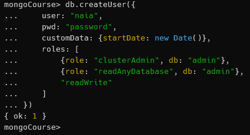

<br>

Para crear más usuarios, simplemente volveríamos a escribir el código anterior, y podríamos ir cambiando los valores de las claves `user` y `pwd`:

> Al ser un ejemplo, sólo he modificado el nombre de usuario.

```js
db.createUser({
    user: "cris",
    pwd: "password",
    customData: {startDate: new Date()},
    roles: [
        {role: "clusterAdmin", db: "admin"},
        {role: "readAnyDatabase", db: "admin"},
        "readWrite"
    ]
})
```

<br>

Para **ver todos los usuarios** que tenemos en la base de datos, ejecutamos el comando `db.getUsers()`:

```js
db.getUsers()
```

<br>

Esta sería la respuesta del comando:

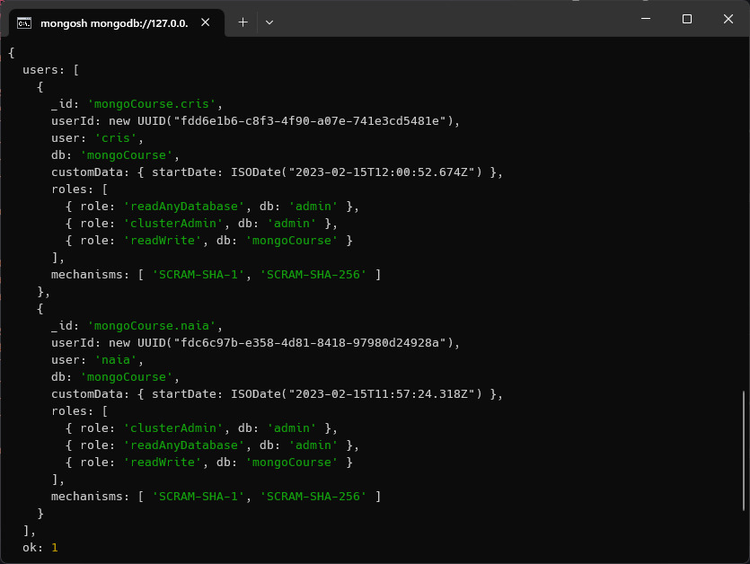

<br>

Como se puede observar, nos devuelve ambos usuarios.

Podemos eliminar un usuario escribiendo el siguiente comando directamente en la terminal:

```js
db.dropUser("cris")
```

<br>

Si volvemos a ejecutar el comando `db.getUsers()`, veremos que ya no aparece el usuario `cris`:

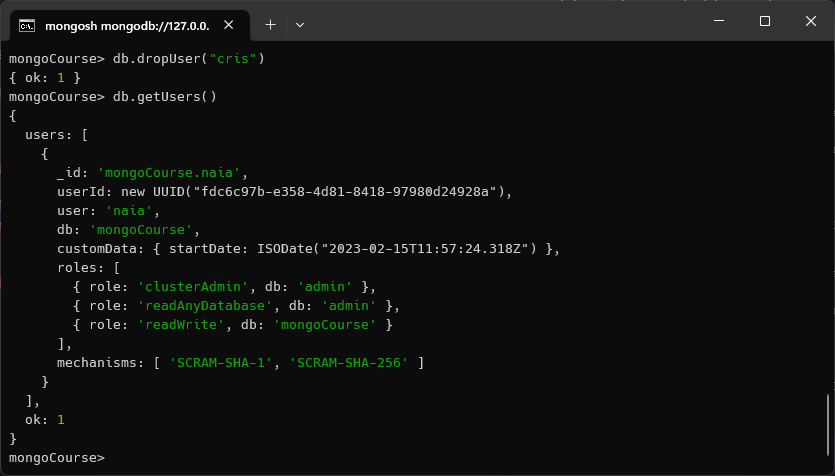


<br><hr><br>


## Crear una colección

<sub>[<< Crear usuario](#crear-un-usuario) | [Volver al índice](#indice) | [Añadir documentos >>](#añadir-documentos-a-una-colección)</sub>

Al escuchar las palabras `base de datos` podríamos pensar en una especie de tabla con información. En el caso de MongoDB, una base de datos es un conjunto de colecciones en vez de una tabla.

En esas colecciones, se almacenan los documentos, pero antes de comenzar a guardar documentos, debemos crear una colección.

<br>

A lo largo de este curso, vamos a crear una base de datos para almacenar libros, por ello, lo primero que debemos hacer ahora es crear una colección a la que llamaremos `books`.

Para realizar esto, vamos a ir a la terminal de `mongosh` y escribiremos el siguiente comando:

```shell
db.createCollection("books")
```

<br>

Tras hacer esto, la terminal devolverá un `{ ok: 1 }`, lo que significa que se ha creado la colección correctamente.

<br>

Para **ver todas las colecciones** que tenemos en la base de datos, ejecutamos el comando:

```shell
show collections
```

<br>

Y veremos que se nos ha creado la colección `books`.


<br><hr>
<hr><br>


## Añadir documentos a una colección

<sub>[<< Crear colección](#crear-una-colección) | [Volver al índice](#indice) | [Añadir varios a la vez >>](#añadir-varios-documentos-a-una-colección)</sub>

Vamos a añadir libros a nuestra base de datos:

```js
db.books.insertOne({
    "name": "OOP Programming",
    "publishedDate": new Date(),
    "authors": [
        {"name": "Jon Snow"},
        {"name": "Ned Stark"},
    ]
})
```

<br>

Si copiamos el código y lo pegamos en la `mongosh`, veremos que se nos ha añaadido el documento correctamente:

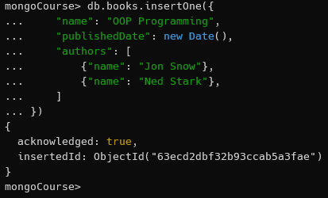

<br>

Podemos modificar el código anterior y escribir el siguiente para añadir otro libro:

```js
db.books.insertOne({
    "name": "OOP Programming",
    "publishedDate": new Date(),
    "authors": [
        {"name": "Jon Snow Jr"},
    ]
})
```

<br>

Vamos incluso a añadir un tercer libro:

```js
db.books.insertOne({
    "name": "OOP Programming",
    "startDate": new Date(),
    "authors": [
        {"name": "Jon Snow Jr"},
    ]
})
```

<br>

Hay datos iguales y otros diferentes en los documentos. Es importante conocer que **MongoDB no sigue ningún esquema**, se pueden añadir documentos con diferentes campos y no se van a ver afectados los demás documentos, ni se nos devolverá ningún error.

Esto puede ser útil y problemático al mismo tiempo, por lo que es importante conocerlo.


<br><hr><br>


## Añadir varios documentos a una colección

<sub>[<< Añadir documentos](#añadir-documentos-a-una-colección) | [Volver al índice](#indice) | [Consultar documentos >>](#consultar-documentos)</sub>

Hemos visto cómo insertar documentos en una colección, pero podríamos querer añadir varios documentos a la vez.

Para ello, realizaremos lo siguiente:

```js
db.books.insertMany([
    {
        "name": "Confident Ruby",
        "publishedDate": new Date(),
        "authors": [
            {"name": "Avdi Grimm"}
        ]
    },
    {
        "name": "The Art of War",
        "publishedDate": new Date(),
        "authors": [
            {"name": "Steven Pressfield"}
        ]
    },
    {
        "name": "Blink",
        "publishedDate": new Date(),
        "authors": [
            {"name": "Malcom Gladwell"}
        ]
    }
])
```

<br>

En este caso, al haber insertado varios documentos a la vez y haberse creado más de uno, la respuesta que nos devuelve la terminal es:

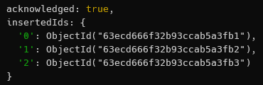

<br>

Donde tenemos una *respuesta* por cada documento que hemos insertado.


<br><hr>
<hr><br>


## Consultar documentos

<sub>[<< Añadir varios](#añadir-varios-documentos-a-una-colección) | [Volver al índice](#indice) | [Consultar específicos >>](#consultar-documentos-específicos)</sub>

Para consultar documentos, vamos a utilizar el comando `find()`.

Vamos a continuar con el ejemplo de los libros, por lo que vamos a escribir el siguiente comando:

```shell
db.books.find()
```

<br>

Se nos devolverán todos los documentos que tenemos en la colección `books`:

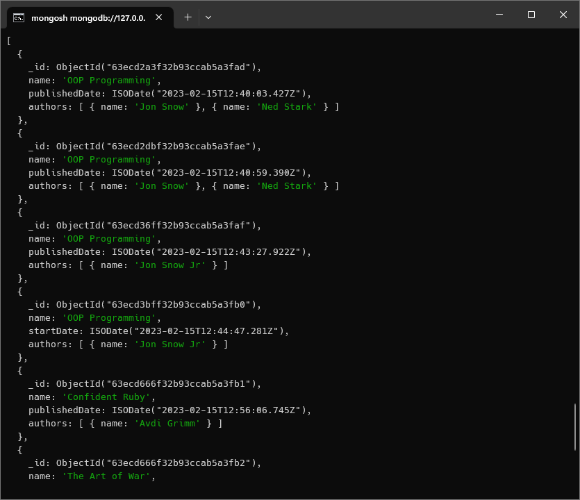

<br>

Este es el equivalente a `SELECT * FROM books;` en SQL.

También podemos ver que MongoDB ha añadido un campo `_id` a cada documento, que es el identificador único de cada documento.


<br><hr><br>


## Consultar documentos específicos

<sub>[<< Consultar documentos](#consultar-documentos) | [Volver al índice](#indice) | [Proyecciones >>](#introducción-a-las-proyecciones)</sub>

Hay ocasiones en las que no queremos consultar todos los documentos de una colección, sino que queremos consultar documentos específicos.

Para ello:

```shell
db.books.find({name: "The Art of War"})
```

<br>

Si ejecutamos el comando anterior, veremos que nos devuelve el documento que tiene el nombre `The Art of War`:


<br>

Si consultamos un dato y hay más de un documento con ese dato, se nos devolverán todos los documentos que tengan ese dato.

<br>

En SQL esto sería equivalente a:

```sql
SELECT * FROM books
WHERE name = "The Art of War";
```


<br><hr><br>


## Introducción a las proyecciones

<sub>[<< Consultar específicos](#consultar-documentos-específicos) | [Volver al índice](#indice) | [Consultar arrays anidados >>](#selección-de-arrays-anidados-usando-slice) </sub>

Las proyecciones son una forma de filtrar los datos que nos devuelve una consulta.

Para usarlas:

```js
db.books.find(
    {
        name: "Confident Ruby"
    },
    {
        publishedDate: 1,
        authors: 1
    }
)
```

<br>

Hemos visto quá ocurre al usar `find()` anteriormente, pero en esta ocasión, le hemos pasado 2 objetos como argumentos:

* El primero es el filtro, que es el que nos va a devolver los documentos que cumplan con las condiciones que le pasemos.

* El segundo es la proyección. Si queremos que nos pase unos atributos concretos, los introducimos en el segundo objeto y les damos el valor de `1` ó `0` si queremos o no que lo muestre.

<br>

Si no quisiéramos que nos devolviera el campo `_id`, podríamos hacer lo siguiente:

```js
db.books.find(
    {
        name: "Confident Ruby"
    },
    {
        _id: 0,
        publishedDate: 1,
        authors: 1
    }
)
```

<br>

Con este ejemplo, dejaríamos de ver el campo `_id` en la respuesta que nos devuelve la terminal.

<br>

La forma de hacer esto mismo con una consulta en SQL sería:

```sql
SELECT publishedDate, authors FROM books
WHERE name = "Confident Ruby";
```


<br><hr><br>


## Selección de arrays anidados usando `$slice`

<sub>[<< Proyecciones](#introducción-a-las-proyecciones) | [Volver al índice](#indice) | [Colecciones anidadas >>](#colecciones-anidadas) </sub>

Tal y como indica el título, en MongoDB, podemos hacer queries de arrays anidados usando `$slice`.

Imaginemos que tenemos el siguiente documento:

```js
db.books.insertOne({
    "name": "Blink",
    "publishedDate": new Date(),
    "authors": [
        {"name": "Malcolm Gladwell"},
        {"name": "Ghost Writer"},
    ]
})
```

<br>

Como vemos, en el apartado de `authors` tenemos un array con 2 objetos, cada uno con un atributo `name`. El objetivo es poder acceder a este documento dejando fuera el segundo autor.

Para ello, vamos a realizar lo siguiente:

```js
db.books.find(
    {
        name: "Blink"
    },
    {
        publishedDate: 1,
        name: 1,
        authors: {
            $slice: 1
        }
    }
)
```

<br>

Usamos `authors` como filtro, y le pasamos un objeto con el atributo `$slice` y el valor `1` para indicar que queremos solo el primer elemento del array.

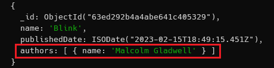

<br>

Si le pasaramos el valor de `$slice: 2`, nos devolvería los 2 primeros elementos del array, es decir, los dos autores.

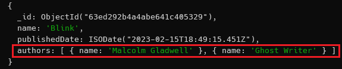

<br>

Si solo quisiéramos que nos devolviera el nombre del segundo autor, podríamos hacer lo siguiente:

```js
db.books.find(
    {
        name: "Blink"
    },
    {
        publishedDate: 1,
        name: 1,
        authors: {
            $slice: -1
        }
    }
)
```

<br>

Al pasarle el valor `-1` a `$slice`, nos devuelve el último elemento del array, es decir, el segundo autor.

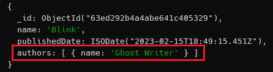


<br><hr><br>


## Colecciones anidadas

<sub>[<< Consultar arrays anidados](#selección-de-arrays-anidados-usando-slice) | [Volver al índice](#indice) | [Buscar un único documento >>](#buscar-un-único-documento)</sub>

Antes de comenzar, vamos a [eliminar del documento](#eliminar-documentos) todos aquellos documentos que tengan `Blink` como nombre para que se vea todo de forma más clara.

<br>

A continuación, realizamos lo siguiente para añadir y tener un único elemento con ese nombre en la colección:

```js
db.books.insertOne({
    "name": "Blink",
    "publishedDate": new Date(),
    "authors": [
        {"name": "Malcolm Gladwell", "active": true},
        {"name": "Ghost Writer", "active": true},
    ]
});
```

<br>

Ahora, lo que queremos es obtener el nombre del autor sin que nos indique si está activo o no.

Para ello:

```js
db.books.find(
    {
        name: "Blink"
    },
    {
        name: 1,
        publishedDate: 1,
        "authors.name": 1
    }
)
```

<br>

`authors` es un array de objetos, y queremos que nos devuelva el atributo `name` de cada uno de ellos.

Tenemos que seleccionar el atributo `name` de `authors` y para ello, tenemos que usar la notación de punto.

Este sería el resultado:

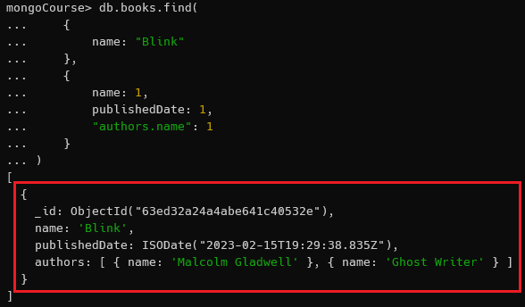


<br><hr><br>


## Buscar un único documento

<sub>[<< Colecciones anidadas](#colecciones-anidadas) | [Volver al índice](#indice) | [Regex >>](#seleccionar-documentos-con-parte-de-strings---regex)</sub>

Antes de comenzar, vamos a introducir de nuevo el documento con nombre `Blink` para así tener dos documentos con dicho nombre.

<br>

Si usamos `find()` nos devolverá los dos documentos. ¿Cómo podemos hacer para que nos devuelva solo uno? Para ello, vamos a usar el método `findOne()`.

```shell
db.books.findOne({name: "Blink"})
```

<br>

Este sería el resultado de usar la función `find()`, donde nos devuelve los dos documentos:


<br>

Mientras que esta sería la salida de `findOne()`, que solo devuelve un documento:


<br>

`findOne()` es una función que nos asegura que sólo vamos a recibir un documento, lo cual en determinadas ocasiones puede ser muy útil.


<br><hr><br>


## Seleccionar documentos con parte de strings - Regex

<sub>[<< Buscar un único documento](#buscar-un-único-documento) | [Volver al índice](#indice) | [Comprobar si existe un campo >>](#comprobar-si-un-campo-existe-o-no)</sub>

Vamos a tratar de hacer *match* con parte de un string y el título (`name` en este caso) de un documento. Para ello, vamos a insertar primero un documento con el siguiente contenido:

```js
db.books.insertOne({
    "name": "Deep Work: Rules for Focused Success in a Distracted World",
    "publishedDate": new Date(),
    "authors": [
        {"name": "Cal Newport"},
    ]
});
```

<br>

Ahora que está añadido, vamos a utilizar **Expresiones Regulares** para escribir parte del `name` y hacer *match* con el nombre del documento.

Para ello, vamos a usar el siguiente comando:

```shell
db.books.findOne({name: /.*deep work.*/i})
```

<br>

El resultado de añadir el documento y tratar de localizarlo haciendo uso de las expresiones regulares, sería el siguiente:

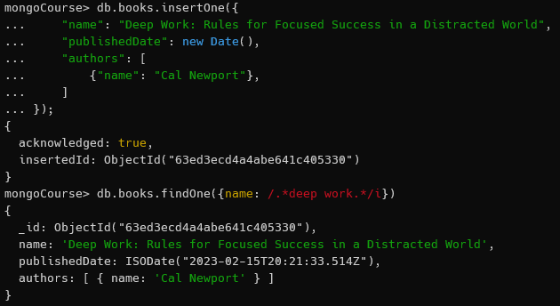

<br>

Si intentáramos localizar el documento sin usar el formato de expresiones regulares, el resultado sería el siguiente:

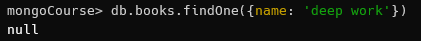

<br>

Como se puede observar, la respuesta esta vez ha sido `null`.

<br>

***¿Cómo funciona?***

* En primer lugar, los `/` son importantes porque indican que se trata de una expresión regular (*también llamadas **regex** para abreviar*).

* Con los `.*` del comienzo y final, indicamos que puede haber cualquier número de caracteres antes y después de la palabra `deep work`.

* Con el `i` al final, indicamos que no queremos que sea insensible a mayúsculas y minúsculas, es decir, que no importará si originalmente está en mayúsculas o minúsculas, lo detectará siempre que sea la *misma letra*.


<br><hr><br>


## Comprobar si un campo existe o no

<sub>[<< Regex](#seleccionar-documentos-con-parte-de-strings---regex) | [Volver al índice](#indice) | [Eliminar documentos >>](#eliminar-documentos)</sub>

Vamos a comenzar esta sección insertando un nuevo elemento en la colección `books`:

```js
db.books.insertOne({
    "name": "Deep Work: Rules for Focused Success in a Distracted World",
    "publishedDate": new Date(),
    "reviews": 100,
    "authors": [
        {"name": "Cal Newport"}
    ]
})
```

<br>

Este va a ser el único documento que contenga el campo `reviews`. Ahora, imaginemos que estamos realizando una búsqueda y necesitamos saber si el documento tiene o no el campo `reviews` para mostrar su contenido o no.

Para ello, vamos a seguir los siguientes pasos:

```shell
db.books.find({reviews: {$exists: true}})
```

<br>

El atributo `$exists` nos permite comprobar si un campo existe o no. En este caso, le estamos diciendo que nos devuelva todos los documentos que tengan el campo `reviews`.

El resultado sería el siguiente:

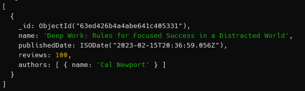

<br>

Como podemos observar, nos devuelve el documento que contiene el campo `reviews` y no el/los que no lo contienen.

<br>

Si quisiéramos que nos devolviera aquellos documentos que **no** contienen el campo `reviews`, tendríamos que cambiar el valor de `$exists` a `false`:

```shell
db.books.find({reviews: {$exists: false}})
```


<br><hr>
<hr><br>


## Eliminar documentos

<sub>[<< Comprobar si existe un campo](#comprobar-si-un-campo-existe-o-no) | [Volver al índice](#indice)</sub>

Hemos visto diferentes formas de seleccionar documentos, ahora, vamos a ver cómo eliminar los que queramos.

Para ello, vamos a usar los siguientes comandos:

```shell
db.books.deleteOne({name: "OOP Programming"})
```

<br>

Si existen varios documentos con el mismo nombre, solo eliminará el primero que encuentre.

La terminal nos devolverá un mensaje mostrando la cantidad de elementos que ha eliminado:


<br>

Si quisieramos eliminar todos los documentos que tengan el mismo nombre, podríamos usar el siguiente comando:

```shell
db.books.deleteMany({name: "OOP Programming"})
```

<br>

Este sería el mensaje esta vez:

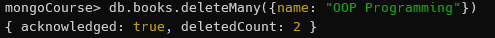