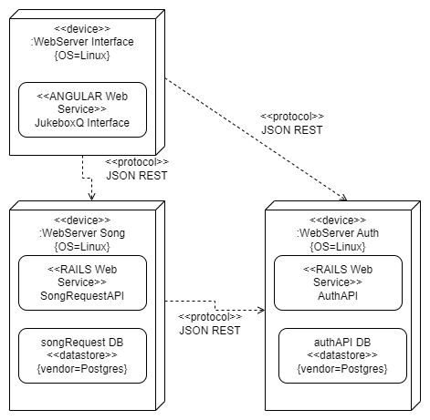

# Deployment diagrams

Los deployment diagrams son diagramas que se utilizan mucho para representar la estructura de un sistema.

Los elementos que lo forman son los siguientes:

* [Nodes](#nodes)
* [Components](#components)
* [Artifacts](#artifacts)
* [Links](#links)
* [Dependencies](#dependencies)
* [Associations](#associations)

 

[<< USE CASE DIAGRAMS](./06_useCaseDiagrams.md#use-case-diagrams) | [PACKAGE DIAGRAMS >>](./08_packageDiagrams.md#package-diagrams)

 

 

## Elementos

### Nodes

Los `node` son uno de los elementos más importantes. Cada una elemento o parte de estos diagramas son un `node`. Pueden ser:

* Un servidor
* Un database
* Un API

 

Pueden ser cualquier cosa que tenga algún tipo de sistema con el que comunicarse.

 
 

### Components

Los `components` son los elementos que se encuentran dentro de los `nodes`. Se representan con un rectángulo con bordes redondeados que contiene el nombre del componente. Es el elemento de software que gestiona la comunicación del `node` al que pertenece.

 
 

### Artifacts

Los `artifacts` son elementos que se encuentran dentro de los `components`. Se representan dentro de `<< >>`. En la imagen de ejemplo, los `artifacts` serían ***device*** y ***ANGULAR Web Service***.

Cuando se va a generar un diagrama de este tipo y se quiere conocer qué tipo de server hay que desplegar, o el tipo de aplicación que se quiere configurar, estos son los elementos que hay que mirar.

 
 

### Links

Los `links` son las conexiones entre los `nodes`. Se representan con una línea que une los `nodes` entre sí.

 
 

### Dependencies

Se representan con una línea punteada que une los `nodes` entre sí. Se utilizan para representar la dependencia entre los `nodes`, es decir, que un `node` depende de otro para funcionar.

 
 

### Associations

Esta es otra forma de conectar los `nodes` entre sí, al igual que los `links` y las `dependencies`, pero esta vez, se utiliza para representar la asociación entre los `nodes`. Es decir, que un `node` está asociado a otro, pero no depende de él para funcionar.

 

 

## Ejemplo

Vamos a crear una aplicación de reproducción de música. Para ello, hará falta un servidor, y vamos a definir todo lo necesario usando deployment diagrams.

Partiendo de esta imagen:

 

Comenzamos por el node situado arriba a la izquierda. En él podemos ver un servicio web de Angular. Esa va a ser la interfaz del usuario para el sistema al completo. Podemos ver que requiere estar en cierto tipo específico de dispositivos (definido por el `artifact` ***device***), que también tiene algunos detalles más, como el sitema operativo de Linux.

 

Este `node` tiene diferentes `dependencies`. Por un lado tiene la dependencia del API, que va a ser la parte encargada del backend, y de la lógica del sistema, y por el otro lado, tiene la dependencia del sistema de autenticación.

 

Por ello, de un simple vistazo, somos capaces de ver que el sistema requiere de otros dos sistemas.

 

 

[<< USE CASE DIAGRAMS](./06_useCaseDiagrams.md#use-case-diagrams) | [PACKAGE DIAGRAMS >>](./08_packageDiagrams.md#package-diagrams)
