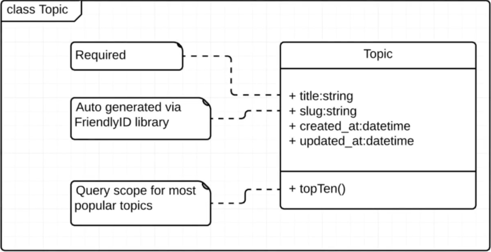
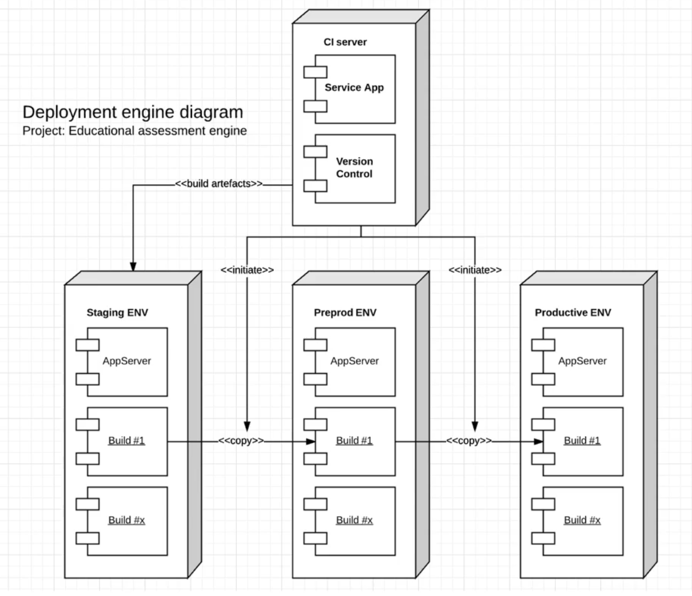
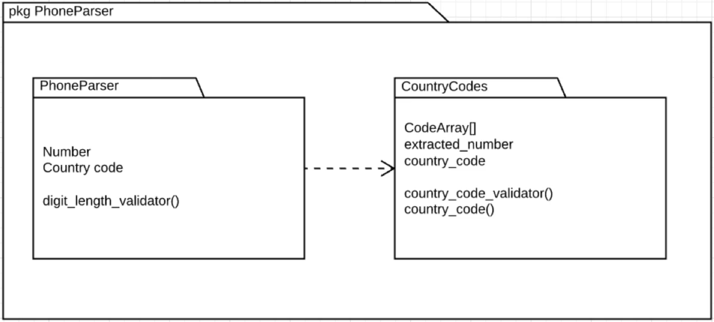

# Structural Diagrams

Tipos de diagramas estructurales:

* [Class Diagrams](#class-diagrams)
* [Deployment Diagrams](#deployment-diagrams)
* [Package Diagrams](#package-diagrams)

 

[<< COMPONENTES](./01_components_and_commonElements.md#componentes-y-elementos-comunes) | [BEHAVIORAL DIAGRAMS >>](./03_behavioralDiagrams.md#behavioral-diagrams)

 

 

## Class Diagrams

Son probablemente los diagramas más comunes. Se utilizan para modelar la estructura de un sistema, incluyendo sus clases, atributos, métodos y relaciones entre ellos.

Los elementos que conforman este tipo de diagramas son:

* Name
* Attributes
* Operations

 

 

En la primera *caja* se representa el nombre de la clase. En la segunda, los atributos, donde se especifica si son públicos, privados o protegidos.

También se indicará el tipo de dato que almacena cada uno de los atributos.

En la tercera, por último, se especifican las operaciones (*funciones*, *métodos*, etc.), indicando también si son públicos, privados o protegidos.

 

Esto es muy útil para poder trabajar con bases de datos, por ejemplo, puesto que echando un pequeño vistazo a la estructura de la clase, podemos saber qué elementos hay que definir y almacenar en la base de datos.

 

 

## Deployment Diagrams

Este tipo de diagrama está creado por 6 elementos:

* Nodes
* Components
* Artifacts
* Links
* Dependencies
* Associations

 

Nos dan la habilidad de modelar cómo debería configurarse una arquitectura de un sistema por completo.

Podemos ver cómo se distribuyen los componentes de un sistema en diferentes nodos, y cómo se comunican entre ellos.

Es muy útil para tener una visión general de cómo conectan los diferentes componentes de un sistema.

 

Este es un ejemplo de un diagrama de despliegue:

 

 

## Package Diagrams

Los elementos que conforman este tipo de diagramas o aquellos que son usados en el mismo son:

* Type
* Classifier
* Class
* Use Case
* Component
* Package
* Constraint
* Dependency
* Event

 

Permiten agrupar elementos de tal forma que se pueda visualizar de forma sencilla las dependencias entre los elementos y las relaciones que existen entre ellos.

 

 

 

[<< COMPONENTES](./01_components_and_commonElements.md#componentes-y-elementos-comunes) | [BEHAVIORAL DIAGRAMS >>](./03_behavioralDiagrams.md#behavioral-diagrams)

