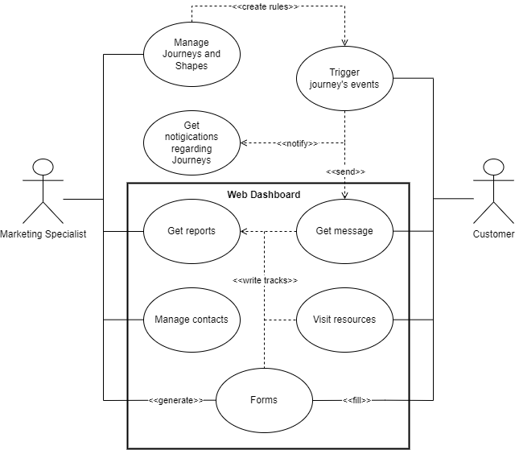

# Use Case diagrams

La razón por la que se utiliza este tipo de diagramas principalmente, es la de poder definir las reglas de autorización y autenticación de los usuarios, así como las restricciones de acceso a los datos.

Los elementos que forman este tipo de diagramas son los siguientes:

* Use case: Es la descripción de una funcionalidad que puede ser realizada por un actor o un sistema. Se representa como un círculo con el nombre de la funcionalidad.
* Actor: Es una persona o un sistema que realiza una acción, puede ser desde un usuario, hasta un API *(por ejemplo)*. Se representa como un círculo con el nombre del actor.
* Subsystem: Es un sistema que contiene un conjunto de use cases. Se representa como un rectángulo grande con el sistema.
* Relación: Es la relación entre un actor y un use case. Se representa como una línea con una flecha que indica la dirección de la relación.

 

 

## Ejemplo

Vamos a crear un sistema de automatización de márqueting:

