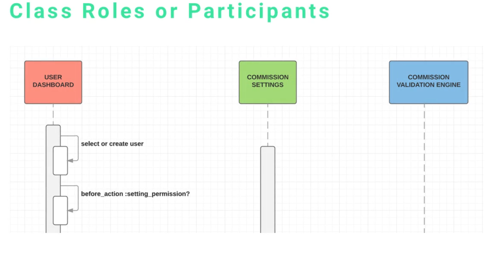
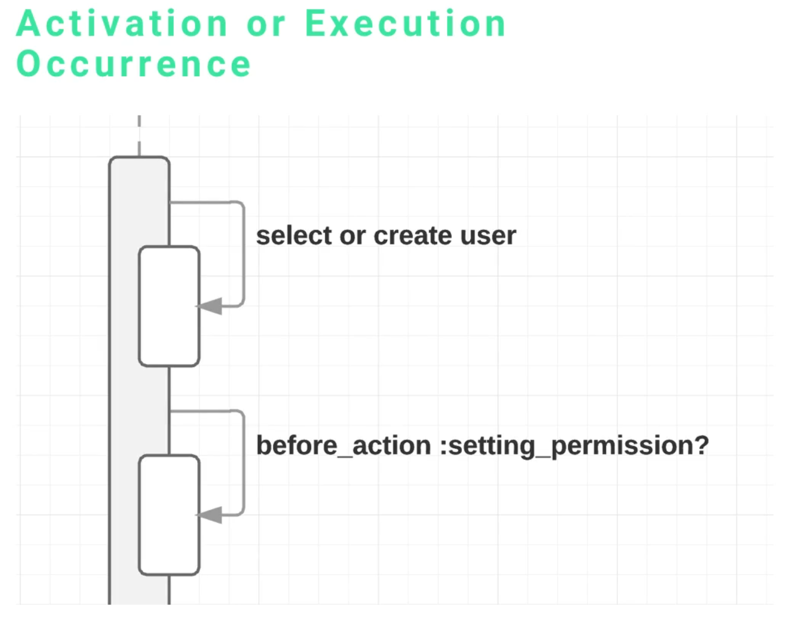
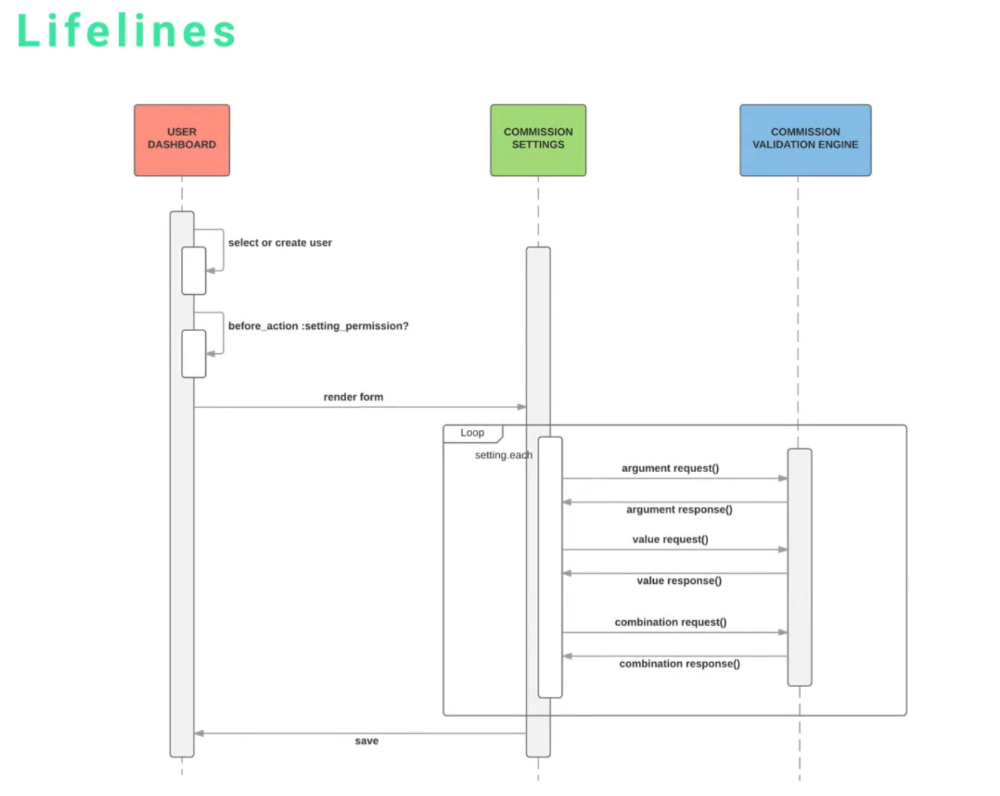

# Diagramas de secuencia

Estos son unos de los diagramas más populares de los que podemos crear con UML. Una de las razones es que no solo permite representar las actividades, los datos y las relaciones, sino que también permite visualizar los mensajes que están siendo intercambiados en el sistema.

Para crear este tipo de diagramas, conviene saber descomponer el sistema al punto de diferenciar cuál es la entrada y cuál es la salida. Es decir, saber describir cada componente, método o lo que sea hasta un punto en el que sea tan simple como una entrada y una salida.

 

 

## Elementos

Los elementos que componen un diagrama de secuencia son:

* Class Roles or Participants
* Activation or Execution Occurrence
* Messages
* Lifelines

 
 

### Class Roles or Participants

Se les puede llamar de las dos formas descritas en el encabezado.

Se representan como rectángulos con el nombre o la descripción del *Class Role* en su interior. Una de las partes buenas de los diagramas de secuencia es que te permiten aislar cada una de las diferentes comunicaciones que tienen los diferentes *Class Roles*.

 
 

### Activation or Execution Occurrence

Básicamente, este elemento es aquel que indica el evento o motivo que ha hecho que se envíe o reciba un mensaje. Esto suele indicar que se trata de algún tipo de método o módulo que se encargue de manejar la comunicación.

 
 

### Messages

Este es el elemento más importante de los diagramas de secuencias.

Se representan como líneas con flechas, las cuales indican cuál es la dirección del mensaje. Pueden tener nombres.

 

Podemos pensar en los mensajes como posibles métodos que tengan la habilidad de recibir una entrada, enviar una salida, y en ocasiones puede recibir de vuelta una salida.

 
 

### Lifelines

Los *Lifelines* son los elementos que se representan como líneas con puntos que van desde el *Participant* hasta abajo del todo del diagrama. Sirven para ayudar a ver mejor los estados y dar una idea de cuándo son enviados los mensajes.

