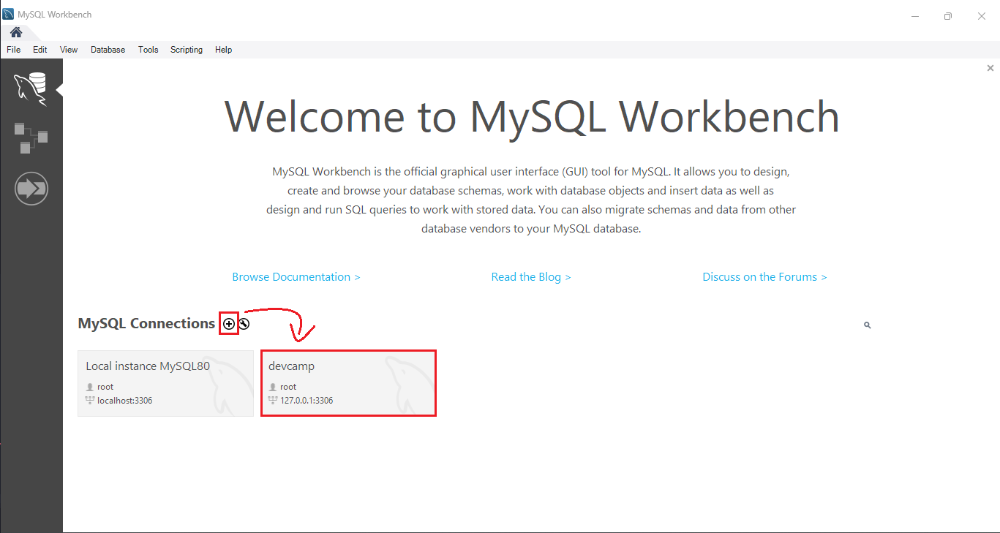
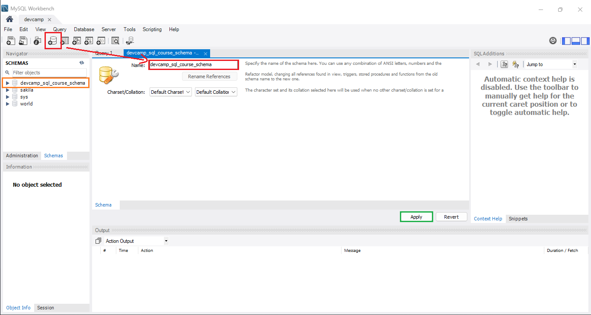

# SQL

<div id="index"></div>

* [Implementaciones](#implementaciones)
* [Descargar e instalar MySQL](#descargar-e-instalar-mysql)
* [Crear un esquema de base de datos](#crear-un-esquema-de-base-de-datos)
* [Crear una tabla](#crear-una-tabla)

<br/>


[<< BLOG FORM (React)](../module_08-react/09_blog/37_blog_form.md#blog-form) | [HOME](../../README.md#devcamp)


<br/><hr/>
<hr/><br/>


<div align='right'>
    <a href='#index'>Volver arriba</a>
</div>


SQL es un lenguaje de programación que se utiliza para trabajar con bases de datos relacionales. El acrónimo **SQL** significa *Structured Query Language* (Lenguaje de Consulta Estructurado).

Se llama **bases de datos relacionales** a aquellas que almacenan la información en tablas, y que relacionan unas tablas con otras mediante claves primarias y claves foráneas.

Las aplicaciones modernas, en su inmensa mayoría, utilizan bases de datos para almacenar la información.


<br/><hr/>
<hr/><br/>


<div align='right'>
    <a href='#index'>Volver arriba</a>
</div>


## Implementaciones

Existen muchas implementaciones de SQL, pero las más utilizadas son:

* **MySQL**: una se las más utilizadas. Es *open source* y está siempre en constante desarrollo. *(La que utilizaremos en este curso)*
* **PostgreSQL**: otra de las más utilizadas. Es muy popular en el mundo de la programación *ruby on rails*.
* **Oracle**: es una de las más antiguas, no es *open source* y es de pago. Es muy utilizada en el mundo empresarial.
* **SQL Server**: muy utilizada en el mundo *.NET*. Esta también es de pago.
* **MariaDB**: aplicaciones como *Facebook* utilizan esta implementación. Es *open source*, pero no está tan extendida como otras.

<br/>

A pesar de existir diferentes implementaciones, el lenguaje SQL es el mismo para todas ellas. La diferencia entre unas y otras es mínima y aprender a usar una implementación hará que sea muy sencillo aprender a usar las demás.


<br/><hr/>
<hr/><br/>


<div align='right'>
    <a href='#index'>Volver arriba</a>
</div>


## Descargar e instalar MySQL

Para poder trabajar con MySQL, lo primero que tenemos que hacer es descargarlo e instalarlo en nuestro ordenador.

Para poder descargar el programa, accederemos a la [página del producto](https://dev.mysql.com/downloads/installer/) y escogeremos la opción de descarga que más se ajuste a nuestro sistema operativo. Después, escogeremos la opción de descarga web (*si estamos conectados a internet*) o la opción de descarga offline (*si no estamos conectados a internet*).

Una vez descargado, clicaremos en él y seguiremos los pasos mostrados [en este vídeo](https://www.youtube.com/watch?v=GIRcpjg-3Eg) o realizaremos la configuración que nos parezca más adecuada.


<br/><hr/>
<hr/><br/>


<div align='right'>
    <a href='#index'>Volver arriba</a>
</div>


## Crear un esquema de base de datos

Ahora que hemos instalado y configurado el *Workbench* de MySQL, vamos a crear un esquema de base de datos.

Para crear un esquema desde aquí, crearemos una conexión clicando el símbolo `+` que aparece en la parte izquierda de la pantalla, o clicando dos veces en alguna conexión que ya tengamos creada (*se nos pedirá la contraseña introducida durante la instalación*).



<br/>

Hecho esto, crearemos un nuevo esquema siguiendo estos pasos:

* **Rojo**: Clicar el botón `Create a new schema in the connected server` que aparece en la parte superior de la pantalla (*tiene una base de datos como icono*). Le pondremos el nombre que queramos (en este caso `devcamp_sql_course_schema`).
* **Verde**: clicar en `Apply` (*abajo a la derecha*). Se nos abrirá una ventana con el código SQL que se ejecutará para crear el esquema. Clicaremos en `Apply` (*abajo a la derecha*) y el esquema se creará.
* **Naranja**: una vez creado el esquema, aparecerá en la parte izquierda de la pantalla, en la sección `SCHEMAS`.

<br/>



<br/>

El código SQL que se ha ejecutado es el siguiente:

```sql
CREATE SCHEMA `devcamp_sql_course_schema`;
```

<br/>

Hemos realizado esta operación utilizando el *Workbench* de MySQL, pero podríamos haber ejecutado el mismo código desde la consola de comandos de MySQL.


<br/><hr/>
<hr/><br/>


<div align='right'>
    <a href='#index'>Volver arriba</a>
</div>


## Crear una tabla

Estos son los pasos a seguir para crear una nueva tabla desde el *Workbench* de MySQL:


* **Rojo**: Para crear una nueva tabla, haremos clic derecho en el esquema que acabamos de crear y seleccionaremos la opción `Create table...`. A continuación, indicaremos el nombre que queremos darle a la tabla (en este caso `users`).
* **Verde**: rellenaremos las filas de la tabla con los datos que queramos. Indicaremos (*marcando los checkbox*) qué condiciones queremos que cumpla cada dato. En la parte inferior podremos abrir diferentes pestañas para ver cómo se han generado los diferentes campos de la tabla. En nuestro caso, hemos creado tres campos:
    * `users_id`: campo de tipo `INT`, clave primaria y autoincremental.
    * `users_name`: campo de tipo `VARCHAR` de 100 caracteres.
    * `users_email`: campo de tipo `VARCHAR` de 80 caracteres, no nulo y único.
* **Naranja**: botón de `Apply`, que ejecutará el código SQL que se ha generado para crear la tabla.

<br/>

Al pulsar el botón, se abre una ventana donde se muestra el código SQL que se va a ejecutar teniendo en cuenta las opeaciones que hemos realizado. Este es el código que se ha generado:

```sql
CREATE TABLE `devcamp_sql_course_schema`.`users` (
    `users_id` INT NOT NULL AUTO_INCREMENT,
    `users_name` VARCHAR(100) NULL,
    `users_email` VARCHAR(80) NOT NULL,
    PRIMARY KEY (`users_id`),
    UNIQUE INDEX `users_id_UNIQUE` (`users_id` ASC) VISIBLE,
    UNIQUE INDEX `users_email_UNIQUE` (`users_email` ASC) VISIBLE);
```